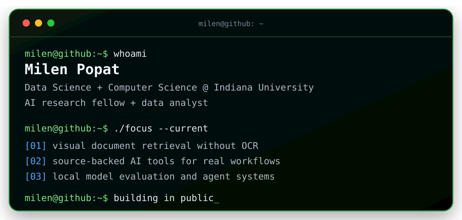
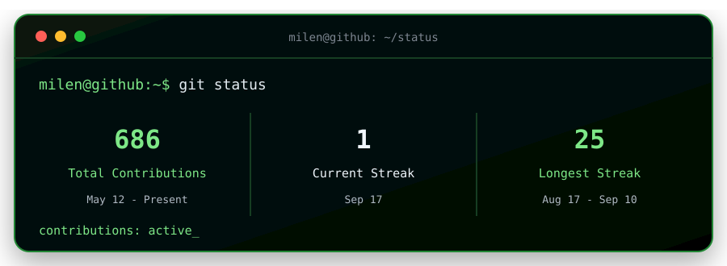

<p align="center">
  
</p>

<p align="center">
  <a href="https://www.linkedin.com/in/milenpopat">LinkedIn</a> ·
  <a href="mailto:mpopat@iu.edu">Email</a> ·
  <a href="https://github.com/mpopat7/portfolio">Portfolio</a>
</p>

## `$ ls ./featured`

### [`multimodal-rag`](https://github.com/mpopat7/multimodal-rag)

Visual document RAG that retrieves pages by what they look like instead of flattening charts, tables, and diagrams into OCR text. The repo includes a ColQwen2 pipeline, an Ollama vision model, and a benchmark against an OCR-text baseline.

`Python` `PyTorch` `ColQwen2` `Ollama`

### [`snap-notice-navigator`](https://github.com/mpopat7/snap-notice-navigator)

An AI tool that turns confusing SNAP benefit letters into plain-language explanations and source-backed next steps. It keeps people in control with a review gate before analysis and links every recommendation to official guidance.

`TypeScript` `Next.js` `Claude` `Zod` · [Live app](https://snap-notice-navigator.vercel.app)

### [`local-ai-hallucination-test`](https://github.com/mpopat7/local-ai-hallucination-test)

A local evaluation harness that asks language models questions about large Python files, computes the real answers with Python's AST, and scores where each model invents or misses code.

`Python` `AST` `Ollama` `Model evaluation`

## `$ cat stack.txt`

```text
languages   Python, TypeScript, SQL
ai/ml       PyTorch, transformers, Ollama, RAG, model evaluation
web/data    Next.js, APIs, data pipelines, Excel
```

Away from code, I produce music in Logic Pro, lift, and live and die with the Detroit Lions.

## `$ git status`

<p align="center">
  
</p>
