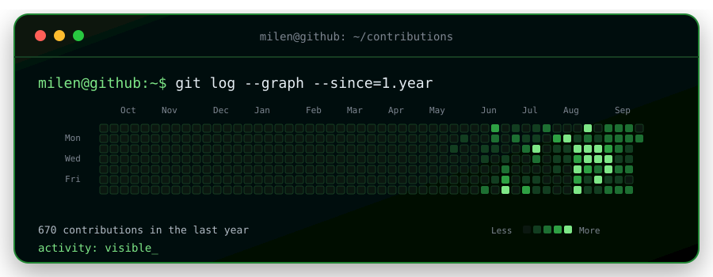

<p align="center">
  
</p>

<p align="center">
  
</p>

<p align="center">
  
</p>

<p align="center">
  <a href="https://www.linkedin.com/in/milenpopat">LinkedIn</a> ·
  <a href="mailto:mpopat@iu.edu">Email</a> ·
  <a href="https://github.com/mpopat7/portfolio">Portfolio</a>
</p>

## `$ cat stack.txt`

```text
languages   Python, TypeScript, SQL
ai/ml       PyTorch, transformers, Ollama, RAG, model evaluation
web/data    Next.js, APIs, data pipelines, Excel
```
